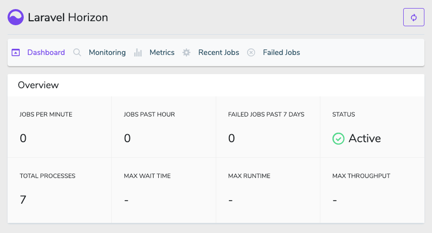

## Laravel Horizon 3.0 Layout

- copy layout.blade.php to resources/views/vendor/horizon

### Changes
- sidebar and container to each row.
- sidebar sticky-top when scroll down.
- disable html min-width, it can use iframe embed in your view. (you can't extends layout. it will broken your css)